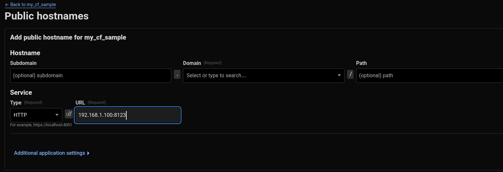

Home Assistant Cloudflare Tunnel
---

This is a Home Assistant addon to access Home Assistant from the internet using a Cloudflare Tunnel.

Requirements
===
A domain is needed and should be registered in Cloudflare (a domain is not free, but the free Cloudflare account plan is enough). This addon also involves some manual configuration edits, so you should have a way of editing the `configuration.yaml` file. I mostly use the `Terminal & SSH` addon, but the `File Editor` addon also works.

Setup the tunnel
===
In Cloudflare, log in with the account that has the domain, then go to "Zero Trust" -> "Networks" -> "Tunnels".

Start by creating a tunnel, select "Cloudflared", give it a name, and save the tunnel. You will be forwarded to the configuration page.

There are a few options listed there; you don't need any of them. On the bottom right, the command for running the tunnel manually is what you need. Use the copy button to copy it to the clipboard (for security reasons, Cloudflare hides the full command in the UI, so make sure to use the copy button next to the command). It will be something like this:
```
cloudflared tunnel run --token A-LONG-GIBBERISH-CODE
```

You need to save the text after `--token`; this is the `cf_token` needed later. At the top, choose the `Public Hostnames` tab and click the "Add a public hostname" button.

On the Hostname part, select the Subdomain and Domain for external access to your Home Assistant. You can leave the subdomain empty to use the main domain. Do not add anything to the path unless you know what you are doing.

On the Service section, add the IP and the protocol of your HA from inside the network (it is normally HTTP, and then an IP as the URL). For example, my Home Assistant local address is `http://192.168.1.100:8123`, so it will be like this image:


Save the changes.

Install the Addon
===

1. Go to **Settings > Add-ons > Add-on Store**.
2. Click the three-dot menu in the top right and select **Repositories**.
3. Paste the URL of this repository: `https://github.com/fzerorubigd/homeassitant-cf` and click **Add**.
4. The addon should now appear in the store. Click on it and then click **Install**.

After installing it, on the configuration tab, add the `cf_token` from the previous step. If everything is OK, the log should show that Cloudflared is running and has registered your tunnel.

Setup the proxy
===
In Home Assistant, go to "Settings" -> "System" -> "Network" and set the "Home Assistant URL". This will be `https://subdomain.domain` (the subdomain and domain you selected in the Cloudflare setup step). Remember, it will be `https` automatically, and the port is not needed.

Now, if you open the address in a browser, you should see `400: Bad Request`. Anything else means that something is wrong.

Setup trusted proxies
===
First, we need to discover the network. If you are using a vanilla Docker setup or Home Assistant OS, the IP should be in the `172.30.x.x` range. To be sure, go to "Settings" -> "System" -> "Logs" and refresh the external URL to see a log like this:

```
Received X-Forwarded-For header from an untrusted proxy 172.30.33.4
```

This is your addon container's IP. Note the IP, and then edit the Home Assistant `configuration.yaml` file using any method you are comfortable with (I use the `Terminal & SSH` addon, but there are other ways). Add this to the file:

```
http:
  use_x_forwarded_for: true
  trusted_proxies:
    - 172.30.33.0/24

```

The IP address from the log is the container's IP. The `/24` in `172.30.33.0/24` is the CIDR notation for the network range, meaning that any IP from `172.30.33.0` to `172.30.33.255` will be trusted. This is generally safe as it's the internal Docker network for Home Assistant. After adding this to your configuration, verify the configuration and restart Home Assistant. You should now be able to connect to your Home Assistant from anywhere using the new address.